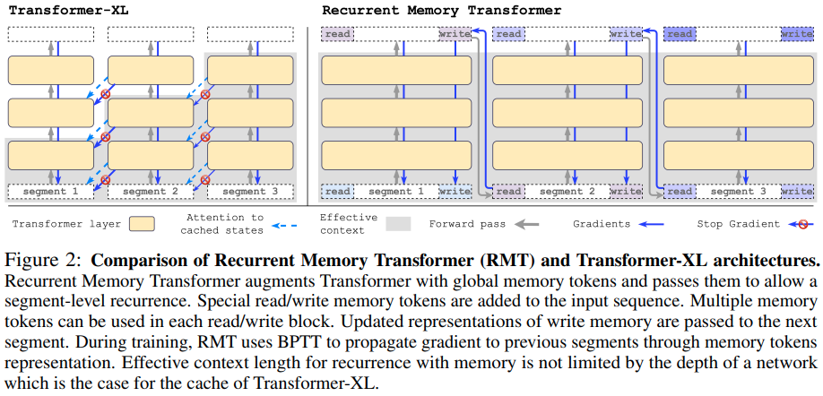

</img>

## Recurrent Memory Transformer - Pytorch

Implementation of <a href="https://arxiv.org/abs/2207.06881">Recurrent Memory Transformer</a> <a href="https://openreview.net/forum?id=Uynr3iPhksa">(openreview)</a> in Pytorch. They had <a href="https://arxiv.org/abs/2304.11062">a short follow up paper</a> recently that demonstrated it was able to copy information across 1 million tokens at the very least.

There is no doubt in my mind that RMT would make a stronger RL agent than <a href="https://sites.google.com/view/adaptive-agent/">AdA</a>, which is just a Transformer-XL

<a href="https://www.youtube.com/watch?v=4Cclp6yPDuw">Yannic Kilcher paper review</a>

## Appreciation

- <a href="https://stability.ai/">Stability</a> and <a href="https://huggingface.co/">🤗 Huggingface</a> for their generous sponsorships to work on and open source cutting edge artificial intelligence research

## Install

```bash
$ pip install recurrent-memory-transformer-pytorch
```

## Usage

```python
import torch
from recurrent_memory_transformer_pytorch import RecurrentMemoryTransformer

model = RecurrentMemoryTransformer(
    num_tokens = 20000,               # number of tokens
    num_memory_tokens = 128,          # number of memory tokens, this will determine the bottleneck for information being passed to the future
    dim = 512,                        # model dimensions
    depth = 6,                        # transformer depth
    causal = True,                    # autoregressive or not
    dim_head = 64,                    # dimension per head
    heads = 8,                        # heads
    seq_len = 1024,                   # sequence length of a segment
    use_flash_attn = True             # whether to use flash attention
)

x = torch.randint(0, 256, (1, 1024))

logits1, mem1, _ = model(x)        # (1, 1024, 20000), (1, 128, 512), None
logits2, mem2, _ = model(x, mem1)  # (1, 1024, 20000), (1, 128, 512), None
logits3, mem3, _ = model(x, mem2)  # (1, 1024, 20000), (1, 128, 512), None

# and so on ...

```

With XL memories

```python
import torch
from recurrent_memory_transformer_pytorch import RecurrentMemoryTransformer

model = RecurrentMemoryTransformer(
    num_tokens = 20000,
    num_memory_tokens = 128,
    dim = 512,
    depth = 6,
    causal = True,
    dim_head = 64,
    heads = 8,
    seq_len = 1024,
    use_flash_attn = True,
    use_xl_memories = True,    # set this to True
    xl_mem_len = 512           # can be shorter than the seq len - i think just having a bit of the past will prevent much of the RMT memories  memorizing the immediate preceding text
)

x = torch.randint(0, 256, (1, 1024))

logits1, mem1, xl_mem1 = model(x)                               # (1, 1024, 20000), (1, 128, 512), [(2, 1, 512, 512)]
logits2, mem2, xl_mem2 = model(x, mem1, xl_memories = xl_mem1)  # (1, 1024, 20000), (1, 128, 512), [(2, 1, 512, 512)]
logits3, mem3, xl_mem3 = model(x, mem2, xl_memories = xl_mem2)  # (1, 1024, 20000), (1, 128, 512), [(2, 1, 512, 512)]

# and so on ...
```

Train on an absurdly long sequence

```python
import torch
from recurrent_memory_transformer_pytorch import (
    RecurrentMemoryTransformer,
    RecurrentMemoryTransformerWrapper
)

model = RecurrentMemoryTransformer(
    num_tokens = 256,
    num_memory_tokens = 128,
    dim = 512,
    depth = 6,
    seq_len = 1024,
    use_flash_attn = True,
    causal = True
)

model = RecurrentMemoryTransformerWrapper(model).cuda()

seq = torch.randint(0, 256, (4, 65536)).cuda()   # absurdly long sequence, in reality, they curriculum learned this starting with 1 segment to about 7-8 segments

loss = model(seq, memory_replay_backprop = True) # memory efficient training from memformer paper

```

## Todo

- [ ] get rotary embeddings working properly with xl memories
- [ ] test on long context genomics, do bidirectional RMT on reverse complement and concat

- [x] add xl memories, detached
- [x] offer a way to turn off rotary embeddings, absolute positional embeddings, and add token shift
- [x] make memories being causally masked an option
- [x] add the memory replay backprop technique from memformer paper
- [x] relative positional encoding

## Alternatives

- <a href="https://github.com/lucidrains/block-recurrent-transformer-pytorch">Block Recurrent Transformer</a>

- <a href="https://github.com/lucidrains/memformer">Memformer</a>

## Citations

```bibtex
@inproceedings{bulatov2022recurrent,
  title     = {Recurrent Memory Transformer},
  author    = {Aydar Bulatov and Yuri Kuratov and Mikhail Burtsev},
  booktitle = {Advances in Neural Information Processing Systems},
  editor    = {Alice H. Oh and Alekh Agarwal and Danielle Belgrave and Kyunghyun Cho},
  year      = {2022},
  url       = {https://openreview.net/forum?id=Uynr3iPhksa}
}
```

```bibtex
@misc{bulatov2023scaling,
  title     = {Scaling Transformer to 1M tokens and beyond with RMT},
  author    = {Aydar Bulatov and Yuri Kuratov and Mikhail S. Burtsev},
  year      = {2023},
  eprint    = {2304.11062},
  archivePrefix = {arXiv},
  primaryClass = {cs.CL}
}
```

```bibtex
@inproceedings{dao2022flashattention,
  title     = {Flash{A}ttention: Fast and Memory-Efficient Exact Attention with {IO}-Awareness},
  author    = {Dao, Tri and Fu, Daniel Y. and Ermon, Stefano and Rudra, Atri and R{\'e}, Christopher},
  booktitle = {Advances in Neural Information Processing Systems},
  year      = {2022}
}
```

```bibtex
@misc{shazeer2020glu,
    title   = {GLU Variants Improve Transformer},
    author  = {Noam Shazeer},
    year    = {2020},
    url     = {https://arxiv.org/abs/2002.05202}
}
```

```bibtex
@misc{su2021roformer,
    title   = {RoFormer: Enhanced Transformer with Rotary Position Embedding},
    author  = {Jianlin Su and Yu Lu and Shengfeng Pan and Bo Wen and Yunfeng Liu},
    year    = {2021},
    eprint  = {2104.09864},
    archivePrefix = {arXiv},
    primaryClass = {cs.CL}
}
```

```bibtex
@inproceedings{Wu2020MemformerAM,
    title   = {Memformer: A Memory-Augmented Transformer for Sequence Modeling},
    author  = {Qingyang Wu and Zhenzhong Lan and Kun Qian and Jing Gu and Alborz Geramifard and Zhou Yu},
    booktitle = {AACL/IJCNLP},
    year    = {2020}
}
```

```bibtex
@software{peng_bo_2021_5196578,
    author    = {PENG Bo},
    title     = {BlinkDL/RWKV-LM: 0.01},
    month     = {aug},
    year      = {2021},
    publisher = {Zenodo},
    version   = {0.01},
    doi       = {10.5281/zenodo.5196578},
    url       = {https://doi.org/10.5281/zenodo.5196578}
}
```

```bibtex
@misc{ding2021cogview,
    title   = {CogView: Mastering Text-to-Image Generation via Transformers},
    author  = {Ming Ding and Zhuoyi Yang and Wenyi Hong and Wendi Zheng and Chang Zhou and Da Yin and Junyang Lin and Xu Zou and Zhou Shao and Hongxia Yang and Jie Tang},
    year    = {2021},
    eprint  = {2105.13290},
    archivePrefix = {arXiv},
    primaryClass = {cs.CV}
}
```

```bibtex
@software{Dayma_DALLE_Mini_2021,
    author  = {Dayma, Boris and Patil, Suraj and Cuenca, Pedro and Saifullah, Khalid and Abraham, Tanishq and Lê Khắc, Phúc and Melas, Luke and Ghosh, Ritobrata},
    doi     = {10.5281/zenodo.5146400},
    license = {Apache-2.0},
    month   = {jul},
    title   = {{DALL·E Mini}},
    url     = {https://github.com/borisdayma/dalle-mini},
    version = {v0.1-alpha},
    year    = {2021}}
```

```bibtex
@inproceedings{anonymous2022normformer,
    title   = {NormFormer: Improved Transformer Pretraining with Extra Normalization},
    author  = {Anonymous},
    booktitle = {Submitted to The Tenth International Conference on Learning Representations },
    year    = {2022},
    url     = {https://openreview.net/forum?id=GMYWzWztDx5},
    note    = {under review}
}
```

```bibtex
@misc{ding2021erniedoc,
    title   = {ERNIE-Doc: A Retrospective Long-Document Modeling Transformer},
    author  = {Siyu Ding and Junyuan Shang and Shuohuan Wang and Yu Sun and Hao Tian and Hua Wu and Haifeng Wang},
    year    = {2021},
    eprint  = {2012.15688},
    archivePrefix = {arXiv},
    primaryClass = {cs.CL}
}
```
